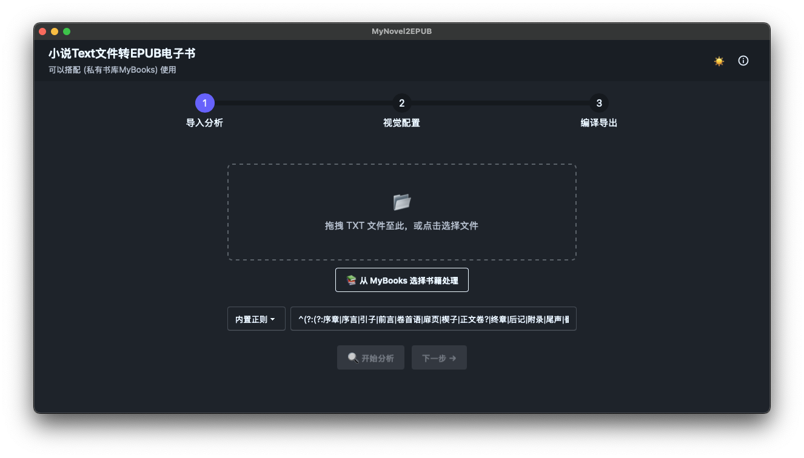
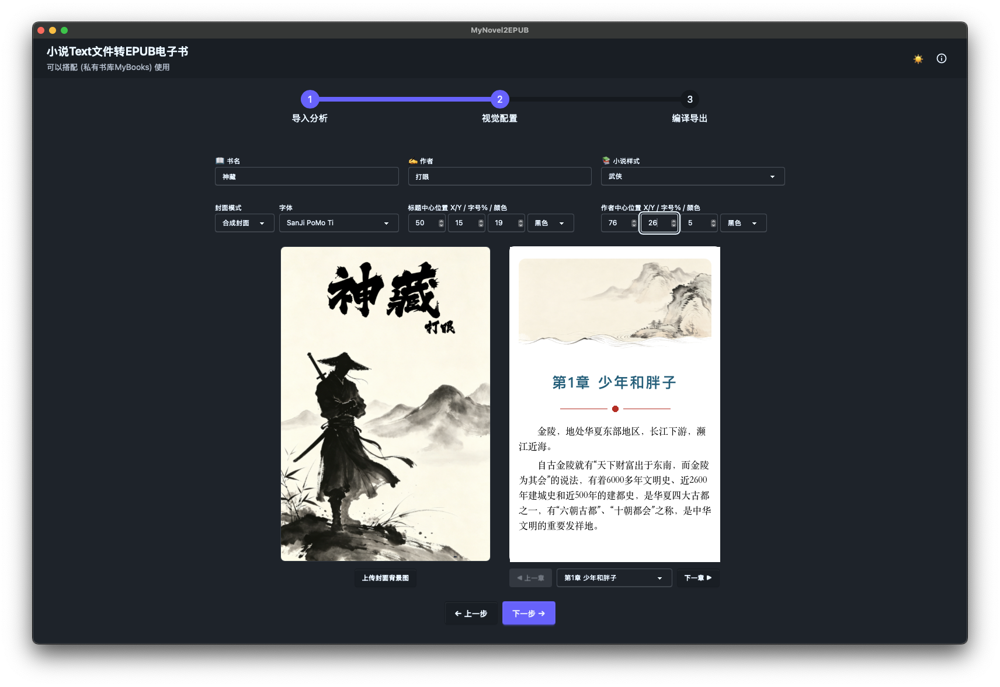

# 项目介绍

MyNovel2EPUB 是一款基于 React + Tauri + Rust 架构开发的轻量级、高性能跨平台桌面端应用。它专注于将本地大体积 `.txt` 文本小说，通过智能章节正则切分、可视化封面与插图配置，最终高保真合成标准的 `.epub` 电子书。

---

## 环境要求

| 工具 | 版本 | 说明 |
|------|------|------|
| Node.js | ≥ 18 | 前端构建 |
| Rust | stable（建议 rustup 安装） | Tauri 后端编译 |
| Tauri CLI | v2（随 `@tauri-apps/cli` devDependency 安装） | `npm run tauri ...` |
| macOS 平台 | Xcode Command Line Tools (`xcode-select --install`) | 编译 + 生成 `.app`/`.dmg` |
| Windows 平台 | Visual Studio Build Tools（含 "Desktop development with C++"）、WebView2 运行时（Win10/11 通常已预装） | 编译 + 生成 `.msi`/`.exe` |

> [!NOTE]
> Tauri 不支持"交叉打包"——在 macOS 上无法直接生成 Windows 安装包，反之亦然。本机只能构建当前系统对应的安装包；要同时产出 Windows + macOS 两份安装包，需在对应系统上各跑一次构建，或使用下方的 CI 矩阵构建。

## 主UI




## 开发调试

```bash
pnpm install
pnpm run tauri dev
```

会启动 Vite 前端热更新 + Tauri 窗口，前后端改动均实时生效。

## 本机构建安装包

```bash
pnpm run tauri build
```

- 在 **macOS** 上执行：产物在 `src-tauri/target/release/bundle/macos/*.app` 与 `src-tauri/target/release/bundle/dmg/*.dmg`
- 在 **Windows** 上执行：产物在 `src-tauri/target/release/bundle/msi/*.msi`（默认 WiX）与/或 `src-tauri/target/release/bundle/nsis/*.exe`（如启用 NSIS）

`tauri.conf.json` 中的 `bundle.targets` 可控制具体生成哪些安装包格式（`"all"` / `["dmg", "msi", "nsis"]` 等）。


## 如何提交你的样式

样式的定义在项目(章节样式)[src-tauri/resources/epub-assets/chapter-styles]目录下，每个样式可以提供：
* cover.png 书籍封面背景，建议为6:9的宽高比, 1200x1800最佳，不要太大。
* header-??.png  章节头的插图，两位数序号命名，如header-01.png，宽度在1000~1200之间，高度在300~800之间，比例是4:3或5:3。
* header-line.png 章节名称下方显示的装饰线
* footer-line.png 章节结束显示的装饰线
